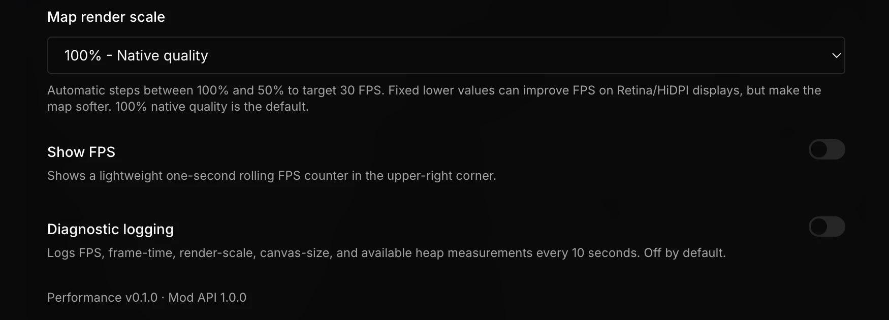

# Subway Builder Performance

A conservative performance mod for Subway Builder. It adds measured manual and adaptive map-rendering controls, an optional FPS counter, and opt-in diagnostics without changing simulation rules.



The mod deliberately does not patch passenger routing, train movement, finances, save data, or simulation timing. Those systems are not exposed through stable performance hooks in Mod API 1.0.0.

## Requirements

- Subway Builder 1.4.12–1.4.x
- Subway Builder Mod API 1.0.0
- Desktop version of the game

The current development and benchmark target is macOS on Subway Builder 1.4.14. Unsupported hooks fail safely and leave native rendering unchanged.

## Installation

### Railyard

After publication, find **Subway Builder Performance** in Railyard and select **Install**. Launch Subway Builder through Railyard, then enable **Performance** in the in-game Mod Manager.

### Manual or development install

1. Download a release ZIP and extract it, or clone this repository.
2. Put the folder in the Subway Builder mods directory:
   - macOS: `~/Library/Application Support/metro-maker4/mods/`
   - Windows: `%APPDATA%\metro-maker4\mods\`
   - Linux: `~/.config/metro-maker4/mods/`
3. Open Subway Builder.
4. Go to **Settings → Mods** and enable **Performance**.
5. Restart the game. During development, `await window.SubwayBuilderAPI.reloadMods()` can reload it from DevTools.

The release ZIP contains `manifest.json`, `index.js`, `README.md`, and `LICENSE` at its root. No build step or bundled runtime dependency is required.

## Performance settings

The mod adds a **Performance** section to the mod settings area.

### Map render scale

Reduces the backing resolution of the MapLibre canvas while keeping the UI at native resolution.

| Setting | Effect | Tradeoff |
| --- | --- | --- |
| Automatic | Targets 30 FPS by stepping between 100% and 50% | Quality can change while playing; off by default |
| 100% | Native device-pixel-ratio rendering | None; default |
| 85% | Modestly lowers GPU fill work | Slight softness |
| 70% | Balanced performance mode | Visible softness on labels and lines |
| 50% | Cuts each canvas dimension in half on a Retina display | Clearly softer map |

This does not alter map data, route geometry, simulation accuracy, or save files. Select 100% at any time to restore native quality.

### Automatic render scale (30 FPS)

Select **Automatic - Target 30 FPS** in the **Map render scale** menu. The mod lowers map quality one step after three consecutive low-FPS samples. It raises quality only after eight consecutive samples with substantial headroom, and waits at least 10 seconds between changes. This asymmetric behavior avoids rapid visual switching.

The option is disabled by default. It stays between 100% and 50%, changes only rendering resolution, and pauses its FPS sampler while the game document is hidden.

### Show FPS

Displays a one-second rolling FPS counter in the upper-right corner. In automatic mode it also shows the active scale. The sampler does no work while all monitoring features are disabled, while the game document is hidden, or outside an active game session.

### Diagnostic logging

Every 10 seconds, logs:

- FPS
- 95th-percentile frame time
- frames slower than 33.4 ms
- render scale
- canvas backing size
- JavaScript heap usage when Chromium exposes it

Logging is disabled by default and is intended for repeatable comparisons or bug reports.

## What was investigated

The installed v1.4.14 application, live Mod API 1.0.0 surface, existing Railyard mods, official documentation, and representative saves were inspected. Commuter pathfinding, interlined-route generation, and arrow computation use Web Workers. A main-simulation worker wrapper exists, but the active 1.4.14 tick path uses a main-thread fallback and is not exposed through the Mod API. The game also maintains separate frequent and infrequent UI stores.

On a large NYC save with 195 stations and 221 trains, the renderer measured about 23 FPS both while paused and at normal simulation speed. That isolates the observed limit to rendering rather than simulation updates. At native Retina quality, the 1155×1073 CSS-pixel map used a 2310×2146 backing canvas, or roughly five million pixels per frame.

See [docs/INVESTIGATION.md](docs/INVESTIGATION.md) for the full scope and rejected patches. See [BENCHMARKS.md](BENCHMARKS.md) for methodology and current measurements.

## Compatibility

- Uses the official `onMapReady` hook and MapLibre's public `getPixelRatio`, `setPixelRatio`, and `resize` methods.
- Does not replace global timers, animation frames, workers, stores, or route functions.
- Hot reload is idempotent: an existing instance is disposed, its overlay is removed, and native render scale is restored before reinitialization.
- Returning to the main menu stops monitoring, removes the overlay, and releases the old map reference.
- If MapLibre render scaling is unavailable, the control becomes a no-op and logs a warning.

Map mods and overlays remain compatible because their sources and layers are untouched. Mods that independently force a canvas pixel ratio may override this setting or be overridden by it, depending on load order.

## Troubleshooting

### Performance section does not appear

- Confirm the folder contains `manifest.json` and `index.js` at its top level.
- Confirm **Performance** is enabled under **Settings → Mods**.
- Open DevTools with F12 and check for `[Performance]` messages.

### Map looks blurry

Set **Map render scale** to **100% - Native quality**.

### FPS does not improve

Render scaling only helps when GPU fill rate or canvas compositing is limiting performance. CPU-bound simulation, pathfinding, another mod, or an active overlay may be the bottleneck instead. Enable diagnostic logging, compare the same camera position for at least 30 seconds, and test once with other mods disabled.

### Large saves run out of memory

Subway Builder already sizes its V8 heap from system RAM. Do not add arbitrary Chromium flags first; follow the game's official [Performance & Memory guide](https://www.subwaybuilder.com/docs/v1.0.0/guides/performance) to inspect the active heap limit and configure a deliberate override if needed.

### Setting does not persist

The desktop storage API is required. Check DevTools for a storage warning. The setting still applies for the current session if persistence fails.

### Recover from an unsupported game update

Disable the mod under **Settings → Mods**. The mod does not modify saves or game files, so removal is safe.

## Development

No dependencies or build step are required.

```bash
npm run verify
```

The verification command syntax-checks the distributable `index.js` and runs the mock Mod API tests.

Release tags matching `v*` run the same checks and create the root-layout ZIP expected by Railyard. See [RAILYARD_SUBMISSION.md](RAILYARD_SUBMISSION.md) for the prepared listing fields and publication checklist.

## License

MIT
