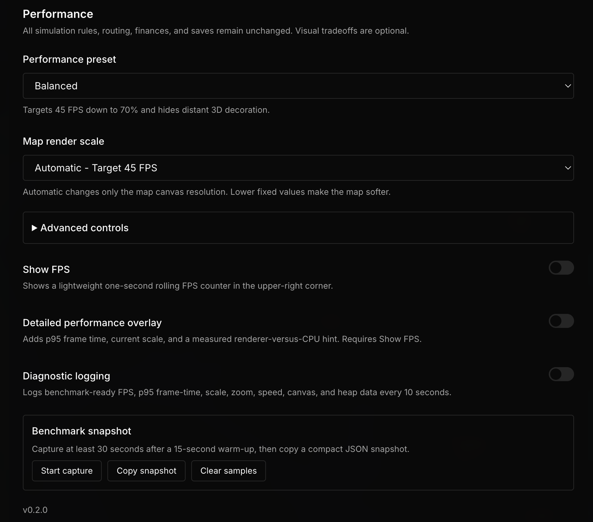

# Subway Builder Performance

Subway Builder Performance improves map rendering with adaptive resolution, quality presets, optional level-of-detail controls, an FPS overlay, and diagnostics. It uses the public Subway Builder Mod API, keeps visual tradeoffs optional, and does not change simulation rules, routing, finances, or saves.

